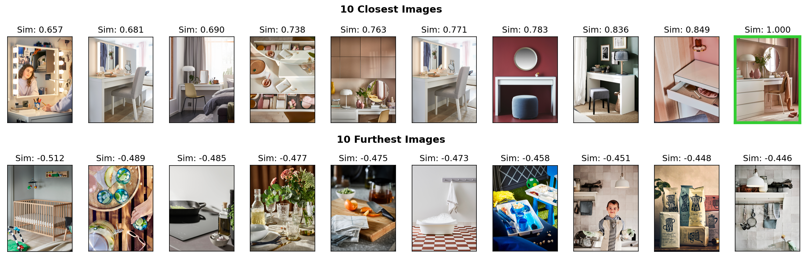

# Session Based Recommender Models

    Example Visualization from Embedding Analysis

This repository contains the python package developed for my master thesis ["Incorporating Reinforcement Learning into Supervised Sequential Recommender Models"](http://urn.kb.se/resolve?urn=urn:nbn:se:liu:diva-195251) in cooperation with IKEA. 

At its core, the package contains the PyTorch implementations of the three models - [GRU4Rec](https://arxiv.org/abs/1511.06939), [SQN](https://dl.acm.org/doi/abs/10.1145/3397271.3401147) and [SMORL](https://dl.acm.org/doi/abs/10.1145/3488560.3498471) - together with the according evaluation framework. It forms the basis for all experiments and results provided in the [thesis](Thesis.pdf).

## Abstract

In the context of the significant expansion of e-commerce, Recommender Systems have become important tools for businesses, enhancing customer engagement through the personalization of product recommendations. This thesis investigates the integration of Reinforcement Learning concepts  into Supervised Learning frameworks, aiming to foster more accurate, novel and diverse recommendations. This study is conducted within the context of IKEA's Inspirational Feed, a  feed of home-furnishing inspirations provided across IKEA's digital platforms. For this purpose, a detailed analytical comparison of three different session-based, sequential recommendation models is executed. This includes the purely supervised GRU4Rec model, as well as two hybrid approaches — SQN and SMORL — which combine Supervised Learning with the Double Q-Learning algorithm from Reinforcement Learning. The primary focus lies on SMORL, a multi-objective model explicitly designed to enhance the diversity and novelty of recommendations. As the results of this analysis reveal, all three models were able to effectively learn interrelationships among IKEA's products and Inspirational Feed images and provided reasonable next image recommendations. However, no evidence was found that the incorporation of Reinforcement Learning in the learning process helped models to improve recommendations. The thesis concludes by proposing potential directions for future research and potential modifications to the experimental design that could possibly alter these findings.

## Usage 

The package can be installed via `pip install .`

All necessary dependencies can be found in the [environment-file](gpu-env.yml).

  

    Example prediction batches of all three model classes

